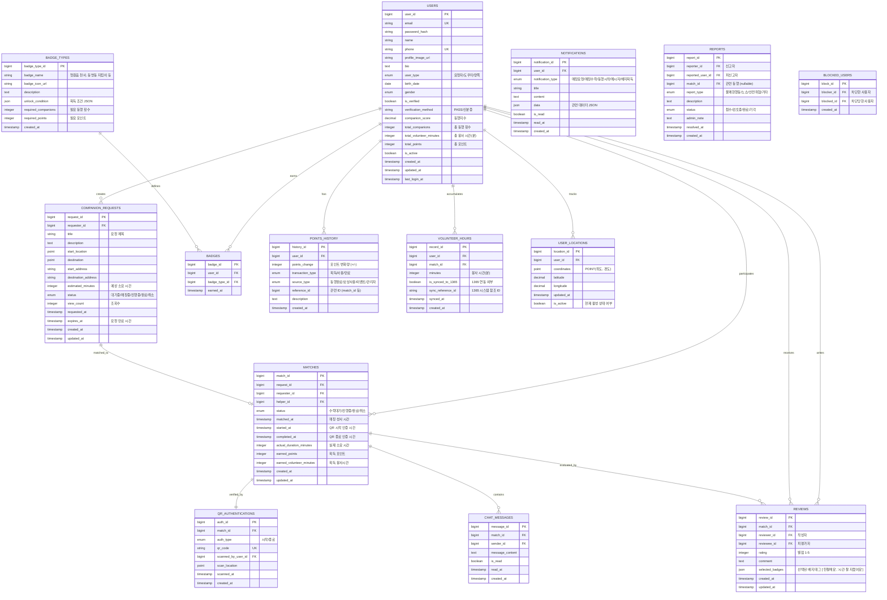

# 동행(Dongheng) 데이터베이스 스키마 설계서

> 작성일: 2025-10-30  
> 버전: 1.0  
> 기반: UI/UX 목업 및 플로우차트 분석

---

## 📋 목차

1. [ERD (Entity Relationship Diagram)](#erd)
2. [테이블 목록 개요](#테이블-목록-개요)
3. [상세 테이블 명세](#상세-테이블-명세)
4. [인덱스 전략](#인덱스-전략)
5. [데이터 타입 가이드](#데이터-타입-가이드)

---

## ERD



---

## 테이블 목록 개요

| 번호 | 테이블명 | 용도 | 주요 관계 |
|------|----------|------|-----------|
| 1 | `USERS` | 사용자 기본 정보 및 통계 | 모든 테이블의 중심 |
| 2 | `USER_LOCATIONS` | 실시간 위치 추적 | USERS (1:N) |
| 3 | `COMPANION_REQUESTS` | 동행 요청 정보 | USERS (1:N), MATCHES (1:1) |
| 4 | `MATCHES` | 매칭 및 동행 진행 정보 | USERS, REQUESTS (N:1) |
| 5 | `QR_AUTHENTICATIONS` | QR 코드 인증 기록 | MATCHES (1:1) |
| 6 | `CHAT_MESSAGES` | 1:1 채팅 메시지 | MATCHES (N:1) |
| 7 | `REVIEWS` | 상호 평가 및 후기 | USERS, MATCHES (N:1) |
| 8 | `BADGE_TYPES` | 배지 종류 정의 | BADGES (1:N) |
| 9 | `BADGES` | 사용자 획득 배지 | USERS, BADGE_TYPES (N:1) |
| 10 | `POINTS_HISTORY` | 포인트 거래 내역 | USERS (N:1) |
| 11 | `VOLUNTEER_HOURS` | 봉사 시간 기록 | USERS, MATCHES (N:1) |
| 12 | `NOTIFICATIONS` | 푸시 알림 기록 | USERS (N:1) |
| 13 | `REPORTS` | 신고 접수 및 처리 | USERS, MATCHES (N:1) |
| 14 | `BLOCKED_USERS` | 사용자 차단 관계 | USERS (N:N self-reference) |

---

## 상세 테이블 명세

### 1. USERS (사용자)

**목적**: 앱 사용자의 기본 정보, 인증 정보, 통계 정보 저장

| 컬럼명 | 데이터 타입 | 제약 조건 | 설명 | UI 연결 |
|--------|-------------|-----------|------|---------|
| `user_id` | BIGINT | PK, AUTO_INCREMENT | 사용자 고유 ID | - |
| `email` | VARCHAR(255) | UNIQUE, NOT NULL | 이메일 (로그인 ID) | 로그인 화면 |
| `password_hash` | VARCHAR(255) | NOT NULL | 암호화된 비밀번호 | 로그인 화면 |
| `name` | VARCHAR(100) | NOT NULL | 실명 | 프로필 설정 - 닉네임 |
| `phone` | VARCHAR(20) | UNIQUE, NOT NULL | 휴대폰 번호 (본인인증) | 온보딩 - PASS 인증 |
| `profile_image_url` | VARCHAR(500) | NULL | 프로필 사진 URL | 프로필 설정 - 카메라 아이콘 |
| `bio` | TEXT | NULL | 자기소개 (최대 100자) | 프로필 설정 - 자기소개 |
| `user_type` | ENUM('requester', 'helper', 'both') | NOT NULL | 사용자 유형 | 사용자 유형 선택 화면 |
| `birth_date` | DATE | NOT NULL | 생년월일 | 온보딩 - 생년월일 |
| `gender` | ENUM('male', 'female', 'prefer_not_to_say') | NOT NULL | 성별 | 온보딩 - 성별 |
| `is_verified` | BOOLEAN | DEFAULT FALSE | 본인 인증 완료 여부 | - |
| `verification_method` | VARCHAR(50) | NULL | 인증 방법 (PASS/신분증) | 가입 및 본인인증 화면 |
| `companion_score` | DECIMAL(5,2) | DEFAULT 0 | 동행지수 (0~100) | 홈 화면 - "동행지수 70" |
| `total_companions` | INT | DEFAULT 0 | 총 동행 횟수 | 마이페이지 |
| `total_volunteer_minutes` | INT | DEFAULT 0 | 총 봉사 시간 (분 단위) | 마이페이지 - 봉사시간 |
| `total_points` | INT | DEFAULT 0 | 현재 보유 포인트 | 마이페이지 - 포인트 |
| `is_active` | BOOLEAN | DEFAULT TRUE | 계정 활성 상태 | - |
| `created_at` | TIMESTAMP | DEFAULT CURRENT_TIMESTAMP | 가입 일시 | - |
| `updated_at` | TIMESTAMP | ON UPDATE CURRENT_TIMESTAMP | 수정 일시 | - |
| `last_login_at` | TIMESTAMP | NULL | 마지막 로그인 일시 | - |

**인덱스**:
- `idx_email` (email)
- `idx_phone` (phone)
- `idx_user_type` (user_type)
- `idx_companion_score` (companion_score DESC)

---

### 2. USER_LOCATIONS (실시간 위치)

**목적**: 사용자의 실시간 GPS 위치 추적 (지도 뷰용)

| 컬럼명 | 데이터 타입 | 제약 조건 | 설명 | UI 연결 |
|--------|-------------|-----------|------|---------|
| `location_id` | BIGINT | PK, AUTO_INCREMENT | 위치 기록 ID | - |
| `user_id` | BIGINT | FK (USERS), NOT NULL | 사용자 ID | - |
| `coordinates` | POINT | NOT NULL | 위도/경도 좌표 (SRID 4326) | 메인 지도 뷰 - 사용자 마커 |
| `latitude` | DECIMAL(10,8) | NOT NULL | 위도 | 메인 지도 뷰 |
| `longitude` | DECIMAL(11,8) | NOT NULL | 경도 | 메인 지도 뷰 |
| `updated_at` | TIMESTAMP | DEFAULT CURRENT_TIMESTAMP | 위치 업데이트 시간 | - |
| `is_active` | BOOLEAN | DEFAULT TRUE | 현재 활성 위치 여부 | - |

**인덱스**:
- `idx_user_id` (user_id)
- `idx_coordinates` (SPATIAL INDEX on coordinates) - 위치 기반 쿼리 최적화
- `idx_is_active` (is_active)

**비고**: 
- 실시간 위치는 5초~10초마다 UPDATE (기존 레코드 갱신)
- 과거 위치 이력이 필요하면 별도 `LOCATION_HISTORY` 테이블 고려

---

### 3. COMPANION_REQUESTS (동행 요청)

**목적**: 요청자가 생성한 동행 요청 정보

| 컬럼명 | 데이터 타입 | 제약 조건 | 설명 | UI 연결 |
|--------|-------------|-----------|------|---------|
| `request_id` | BIGINT | PK, AUTO_INCREMENT | 요청 고유 ID | - |
| `requester_id` | BIGINT | FK (USERS), NOT NULL | 요청자 ID | - |
| `title` | VARCHAR(200) | NOT NULL | 요청 제목 | 지도 뷰 - 요청 카드 제목 |
| `description` | TEXT | NULL | 상세 설명 | 요청 상세 보기 |
| `start_location` | POINT | NOT NULL | 출발지 좌표 | 지도 뷰 - 출발지 마커 |
| `destination` | POINT | NOT NULL | 목적지 좌표 | 지도 뷰 - 목적지 마커 |
| `start_address` | VARCHAR(500) | NOT NULL | 출발지 주소 | 요청 화면 - "현재 위치" |
| `destination_address` | VARCHAR(500) | NOT NULL | 목적지 주소 | 요청 화면 - "세브란스병원" |
| `estimated_minutes` | INT | NOT NULL | 예상 소요 시간 (분) | 지도 뷰 - "약 10분 후" |
| `status` | ENUM('pending', 'matching', 'ongoing', 'completed', 'cancelled') | DEFAULT 'pending' | 요청 상태 | - |
| `view_count` | INT | DEFAULT 0 | 조회수 | - |
| `requested_at` | TIMESTAMP | DEFAULT CURRENT_TIMESTAMP | 요청 생성 시간 | - |
| `expires_at` | TIMESTAMP | NOT NULL | 요청 만료 시간 | 플로우차트 - "5분 거리 이내" |
| `created_at` | TIMESTAMP | DEFAULT CURRENT_TIMESTAMP | - | - |
| `updated_at` | TIMESTAMP | ON UPDATE CURRENT_TIMESTAMP | - | - |

**인덱스**:
- `idx_requester_id` (requester_id)
- `idx_status` (status)
- `idx_start_location` (SPATIAL INDEX)
- `idx_destination` (SPATIAL INDEX)
- `idx_expires_at` (expires_at) - 만료된 요청 정리용

---

### 4. MATCHES (매칭 및 동행)

**목적**: 요청과 도우미가 매칭되어 실제 동행이 진행되는 정보

| 컬럼명 | 데이터 타입 | 제약 조건 | 설명 | UI 연결 |
|--------|-------------|-----------|------|---------|
| `match_id` | BIGINT | PK, AUTO_INCREMENT | 매칭 고유 ID | - |
| `request_id` | BIGINT | FK (COMPANION_REQUESTS), NOT NULL | 요청 ID | - |
| `requester_id` | BIGINT | FK (USERS), NOT NULL | 요청자 ID | - |
| `helper_id` | BIGINT | FK (USERS), NOT NULL | 도우미 ID | 실시간 동행 뷰 - 상대방 프로필 |
| `status` | ENUM('accepted', 'ongoing', 'completed', 'cancelled') | DEFAULT 'accepted' | 매칭 상태 | - |
| `matched_at` | TIMESTAMP | DEFAULT CURRENT_TIMESTAMP | 매칭 성사 시간 | - |
| `started_at` | TIMESTAMP | NULL | 동행 시작 시간 (QR 인증) | QR 인증 뷰 - 시작 |
| `completed_at` | TIMESTAMP | NULL | 동행 완료 시간 (QR 인증) | QR 인증 뷰 - 종료 |
| `actual_duration_minutes` | INT | NULL | 실제 소요 시간 (분) | 동행 상세 - "2h 00m" |
| `earned_points` | INT | NULL | 획득 포인트 | 후기 화면 - "획득 포인트: +300p" |
| `earned_volunteer_minutes` | INT | NULL | 획득 봉사시간 (분) | 후기 화면 - "봉사시간: 0h 20m" |
| `created_at` | TIMESTAMP | DEFAULT CURRENT_TIMESTAMP | - | - |
| `updated_at` | TIMESTAMP | ON UPDATE CURRENT_TIMESTAMP | - | - |

**인덱스**:
- `idx_request_id` (request_id)
- `idx_requester_id` (requester_id)
- `idx_helper_id` (helper_id)
- `idx_status` (status)
- `idx_matched_at` (matched_at DESC)

**비즈니스 로직**:
- `actual_duration_minutes = TIMESTAMPDIFF(MINUTE, started_at, completed_at)`
- 포인트/봉사시간 계산: `동행 시간 * 포인트 배율` (예: 10분당 100p)

---

### 5. QR_AUTHENTICATIONS (QR 코드 인증)

**목적**: 동행 시작/종료 시 QR 코드 스캔 기록

| 컬럼명 | 데이터 타입 | 제약 조건 | 설명 | UI 연결 |
|--------|-------------|-----------|------|---------|
| `auth_id` | BIGINT | PK, AUTO_INCREMENT | 인증 ID | - |
| `match_id` | BIGINT | FK (MATCHES), NOT NULL | 매칭 ID | - |
| `auth_type` | ENUM('start', 'end') | NOT NULL | 인증 유형 | QR 인증 뷰 |
| `qr_code` | VARCHAR(255) | UNIQUE, NOT NULL | QR 코드 고유값 | - |
| `scanned_by_user_id` | BIGINT | FK (USERS), NULL | QR 스캔한 사용자 ID (스캔 전 NULL) | - |
| `scan_location` | POINT | NULL | 스캔 위치 (부정 방지) | - |
| `scanned_at` | TIMESTAMP | NULL | 스캔 시간 (스캔 전 NULL) | - |
| `created_at` | TIMESTAMP | DEFAULT CURRENT_TIMESTAMP | QR 생성 시간 | - |

**인덱스**:
- `idx_match_id` (match_id)
- `idx_qr_code` (qr_code)

**비즈니스 로직**:
- **QR 코드 생성 타이밍**: 매칭 성사 시 시작/종료 QR 둘 다 미리 생성 (UUID 기반)
- 생성 시점에는 `scanned_by_user_id`와 `scanned_at`이 NULL
- 스캔 시 해당 필드들을 UPDATE
- **시작 QR**: 요청자가 보여줌 → **도우미가 스캔**
- **종료 QR**: 요청자가 보여줌 → **도우미가 스캔**
- **요청자는 QR 코드를 보여주기만** 하면 되며, 스캔 기능은 도우미만 사용
- 이는 디지털 리터러시가 상대적으로 낮을 수 있는 요청자의 사용 부담을 최소화하기 위함

---

### 6. CHAT_MESSAGES (채팅)

**목적**: 매칭된 사용자 간 1:1 실시간 채팅

| 컬럼명 | 데이터 타입 | 제약 조건 | 설명 | UI 연결 |
|--------|-------------|-----------|------|---------|
| `message_id` | BIGINT | PK, AUTO_INCREMENT | 메시지 ID | - |
| `match_id` | BIGINT | FK (MATCHES), NOT NULL | 매칭 ID | - |
| `sender_id` | BIGINT | FK (USERS), NOT NULL | 발신자 ID | 채팅 화면 - 말풍선 |
| `message_content` | TEXT | NOT NULL | 메시지 내용 | 채팅 화면 - "친절해요", "동명이 빨라요" |
| `is_read` | BOOLEAN | DEFAULT FALSE | 읽음 여부 | - |
| `read_at` | TIMESTAMP | NULL | 읽은 시간 | - |
| `created_at` | TIMESTAMP | DEFAULT CURRENT_TIMESTAMP | 전송 시간 | - |

**인덱스**:
- `idx_match_id` (match_id)
- `idx_sender_id` (sender_id)
- `idx_created_at` (created_at DESC)

---

### 7. REVIEWS (상호 평가)

**목적**: 동행 완료 후 서로에게 남기는 별점 및 후기

| 컬럼명 | 데이터 타입 | 제약 조건 | 설명 | UI 연결 |
|--------|-------------|-----------|------|---------|
| `review_id` | BIGINT | PK, AUTO_INCREMENT | 후기 ID | - |
| `match_id` | BIGINT | FK (MATCHES), NOT NULL | 매칭 ID | - |
| `reviewer_id` | BIGINT | FK (USERS), NOT NULL | 작성자 ID | - |
| `reviewee_id` | BIGINT | FK (USERS), NOT NULL | 피평가자 ID | - |
| `rating` | TINYINT | NOT NULL, CHECK (1~5) | 별점 (1~5) | 평가 화면 - 별 아이콘 |
| `comment` | TEXT | NULL | 후기 내용 | 평가 화면 - "감사 메시지" 입력 |
| `selected_badges` | JSON | NULL | 선택한 배지 태그 배열 | 평가 화면 - "친절해요", "시간잘지켰어요" |
| `created_at` | TIMESTAMP | DEFAULT CURRENT_TIMESTAMP | 작성 시간 | - |
| `updated_at` | TIMESTAMP | ON UPDATE CURRENT_TIMESTAMP | 수정 시간 | - |

**JSON 예시** (`selected_badges`):
```json
["친절해요", "시간 잘 지켰어요", "소통이 원활해요"]
```

**인덱스**:
- `idx_match_id` (match_id)
- `idx_reviewee_id` (reviewee_id) - 특정 사용자가 받은 후기 조회
- `idx_rating` (rating)

**제약 조건**:
- `UNIQUE(match_id, reviewer_id)` - 한 매칭당 한 번만 작성 가능

---

### 8. BADGE_TYPES (배지 종류)

**목적**: 시스템에서 정의한 배지 종류 마스터 데이터

| 컬럼명 | 데이터 타입 | 제약 조건 | 설명 | UI 연결 |
|--------|-------------|-----------|------|---------|
| `badge_type_id` | BIGINT | PK, AUTO_INCREMENT | 배지 타입 ID | - |
| `badge_name` | VARCHAR(100) | UNIQUE, NOT NULL | 배지 이름 | 홈 화면 - 배지 3개 표시 |
| `badge_icon_url` | VARCHAR(500) | NULL | 배지 아이콘 이미지 URL | - |
| `description` | TEXT | NULL | 배지 설명 | - |
| `unlock_condition` | JSON | NOT NULL | 획득 조건 (JSON) | - |
| `required_companions` | INT | DEFAULT 0 | 필요 동행 횟수 | - |
| `required_points` | INT | DEFAULT 0 | 필요 포인트 | - |
| `created_at` | TIMESTAMP | DEFAULT CURRENT_TIMESTAMP | - | - |

**JSON 예시** (`unlock_condition`):
```json
{
  "type": "companion_count",
  "threshold": 10,
  "description": "10회 동행 완료"
}
```

**초기 데이터 예시**:
- "첫걸음 천사" (1회 동행 완료)
- "동명동 지킴이" (동명동에서 5회 동행)
- "이달의 동행왕" (월간 동행 1위)

---

### 9. BADGES (사용자 획득 배지)

**목적**: 사용자가 획득한 배지 기록

| 컬럼명 | 데이터 타입 | 제약 조건 | 설명 | UI 연결 |
|--------|-------------|-----------|------|---------|
| `badge_id` | BIGINT | PK, AUTO_INCREMENT | 배지 획득 ID | - |
| `user_id` | BIGINT | FK (USERS), NOT NULL | 사용자 ID | - |
| `badge_type_id` | BIGINT | FK (BADGE_TYPES), NOT NULL | 배지 타입 ID | 홈 화면 - 배지 아이콘 |
| `earned_at` | TIMESTAMP | DEFAULT CURRENT_TIMESTAMP | 획득 시간 | - |

**인덱스**:
- `idx_user_id` (user_id)
- `idx_badge_type_id` (badge_type_id)

**제약 조건**:
- `UNIQUE(user_id, badge_type_id)` - 같은 배지 중복 획득 방지

---

### 10. POINTS_HISTORY (포인트 거래 내역)

**목적**: 포인트 획득/사용 이력 추적

| 컬럼명 | 데이터 타입 | 제약 조건 | 설명 | UI 연결 |
|--------|-------------|-----------|------|---------|
| `history_id` | BIGINT | PK, AUTO_INCREMENT | 거래 ID | - |
| `user_id` | BIGINT | FK (USERS), NOT NULL | 사용자 ID | - |
| `points_change` | INT | NOT NULL | 포인트 변화량 (+/-) | 마이페이지 - 포인트 내역 |
| `transaction_type` | ENUM('earn', 'spend', 'expire') | NOT NULL | 거래 유형 | - |
| `source_type` | ENUM('companion', 'reward_usage', 'event', 'admin') | NOT NULL | 출처 유형 | - |
| `reference_id` | BIGINT | NULL | 관련 ID (match_id 등) | - |
| `description` | TEXT | NULL | 설명 | 동행 상세 - "획득 포인트: +300p" |
| `created_at` | TIMESTAMP | DEFAULT CURRENT_TIMESTAMP | 거래 시간 | - |

**인덱스**:
- `idx_user_id` (user_id)
- `idx_transaction_type` (transaction_type)
- `idx_created_at` (created_at DESC)

**source_type 설명**:
- `'companion'`: 동행 완료로 인한 포인트 획득
- `'reward_usage'`: 보상 교환으로 인한 포인트 사용 (구체적 방법은 추후 결정)
- `'event'`: 이벤트성 포인트 지급/차감
- `'admin'`: 관리자에 의한 수동 조정

**예시 데이터**:
```sql
-- 동행 완료로 포인트 획득
(user_id=1, points_change=300, transaction_type='earn', source_type='companion', reference_id=10, description='동행 완료 보상')

-- 보상 사용으로 포인트 차감 (사용처는 추후 결정)
(user_id=1, points_change=-500, transaction_type='spend', source_type='reward_usage', description='보상 교환')

-- 이벤트로 포인트 획득
(user_id=1, points_change=1000, transaction_type='earn', source_type='event', description='가입 축하 보너스')
```

**비즈니스 로직**:
- 포인트 사용 방식(기프티콘, 제휴업체 할인 등)은 추후 팀 논의를 통해 결정
- `description` 필드에 구체적인 거래 내용 기록
- 향후 보상 시스템 확정 시 필요에 따라 테이블 구조 확장 가능

---

### 11. VOLUNTEER_HOURS (봉사 시간)

**목적**: 동행 활동의 봉사 시간 기록 및 1365 연동

| 컬럼명 | 데이터 타입 | 제약 조건 | 설명 | UI 연결 |
|--------|-------------|-----------|------|---------|
| `record_id` | BIGINT | PK, AUTO_INCREMENT | 기록 ID | - |
| `user_id` | BIGINT | FK (USERS), NOT NULL | 사용자 ID | - |
| `match_id` | BIGINT | FK (MATCHES), NOT NULL | 매칭 ID | - |
| `minutes` | INT | NOT NULL | 봉사 시간 (분) | 동행 상세 - "봉사시간: 2h 00m" |
| `is_synced_to_1365` | BOOLEAN | DEFAULT FALSE | 1365 연동 여부 | UI 구성 - "1365 자원봉사 인정" 배지 |
| `sync_reference_id` | VARCHAR(255) | NULL | 1365 시스템 참조 ID | - |
| `synced_at` | TIMESTAMP | NULL | 연동 완료 시간 | - |
| `created_at` | TIMESTAMP | DEFAULT CURRENT_TIMESTAMP | 기록 생성 시간 | - |

**인덱스**:
- `idx_user_id` (user_id)
- `idx_match_id` (match_id)
- `idx_is_synced` (is_synced_to_1365)

---

### 12. NOTIFICATIONS (알림)

**목적**: 푸시 알림 및 인앱 알림 관리

| 컬럼명 | 데이터 타입 | 제약 조건 | 설명 | UI 연결 |
|--------|-------------|-----------|------|---------|
| `notification_id` | BIGINT | PK, AUTO_INCREMENT | 알림 ID | - |
| `user_id` | BIGINT | FK (USERS), NOT NULL | 수신자 ID | - |
| `notification_type` | ENUM('match_request', 'match_accepted', 'companion_start', 'message', 'badge_earned', 'system') | NOT NULL | 알림 유형 | - |
| `title` | VARCHAR(200) | NOT NULL | 알림 제목 | 홈 화면 - 알림 아이콘 |
| `content` | TEXT | NOT NULL | 알림 내용 | - |
| `data` | JSON | NULL | 관련 데이터 (딥링크용) | - |
| `is_read` | BOOLEAN | DEFAULT FALSE | 읽음 여부 | - |
| `read_at` | TIMESTAMP | NULL | 읽은 시간 | - |
| `created_at` | TIMESTAMP | DEFAULT CURRENT_TIMESTAMP | 발송 시간 | - |

**JSON 예시** (`data`):
```json
{
  "type": "match_request",
  "match_id": 123,
  "deep_link": "dongheng://match/123"
}
```

**인덱스**:
- `idx_user_id` (user_id)
- `idx_is_read` (is_read)
- `idx_created_at` (created_at DESC)

---

### 13. REPORTS (신고)

**목적**: 사용자 신고 접수 및 관리자 처리

| 컬럼명 | 데이터 타입 | 제약 조건 | 설명 | UI 연결 |
|--------|-------------|-----------|------|---------|
| `report_id` | BIGINT | PK, AUTO_INCREMENT | 신고 ID | - |
| `reporter_id` | BIGINT | FK (USERS), NOT NULL | 신고자 ID | - |
| `reported_user_id` | BIGINT | FK (USERS), NOT NULL | 피신고자 ID | 마이페이지 - 신고하기 |
| `match_id` | BIGINT | FK (MATCHES), NULL | 관련 동행 ID | - |
| `report_type` | ENUM('inappropriate_behavior', 'no_show', 'safety_threat', 'other') | NOT NULL | 신고 유형 | - |
| `description` | TEXT | NOT NULL | 신고 내용 | - |
| `status` | ENUM('pending', 'reviewing', 'completed', 'rejected') | DEFAULT 'pending' | 처리 상태 | - |
| `admin_note` | TEXT | NULL | 관리자 메모 | - |
| `resolved_at` | TIMESTAMP | NULL | 처리 완료 시간 | - |
| `created_at` | TIMESTAMP | DEFAULT CURRENT_TIMESTAMP | 신고 접수 시간 | - |

**인덱스**:
- `idx_reported_user_id` (reported_user_id)
- `idx_status` (status)
- `idx_created_at` (created_at DESC)

---

### 14. BLOCKED_USERS (차단)

**목적**: 사용자 간 차단 관계 관리

| 컬럼명 | 데이터 타입 | 제약 조건 | 설명 | UI 연결 |
|--------|-------------|-----------|------|---------|
| `block_id` | BIGINT | PK, AUTO_INCREMENT | 차단 ID | - |
| `blocker_id` | BIGINT | FK (USERS), NOT NULL | 차단한 사용자 ID | - |
| `blocked_id` | BIGINT | FK (USERS), NOT NULL | 차단당한 사용자 ID | 마이페이지 - 차단 목록 |
| `created_at` | TIMESTAMP | DEFAULT CURRENT_TIMESTAMP | 차단 시간 | - |

**인덱스**:
- `idx_blocker_id` (blocker_id)
- `idx_blocked_id` (blocked_id)

**제약 조건**:
- `UNIQUE(blocker_id, blocked_id)` - 중복 차단 방지
- `CHECK(blocker_id != blocked_id)` - 자기 자신 차단 방지

---

## 인덱스 전략

### 🎯 위치 기반 쿼리 최적화

**주요 쿼리 패턴**:
```sql
-- 내 주변 5km 이내 요청 찾기
SELECT * FROM COMPANION_REQUESTS
WHERE ST_Distance_Sphere(start_location, POINT(경도, 위도)) <= 5000
AND status = 'pending';
```

**최적화 방안**:
- `USER_LOCATIONS.coordinates` → SPATIAL INDEX 필수
- `COMPANION_REQUESTS.start_location` → SPATIAL INDEX 필수
- MySQL 8.0+ 의 `ST_Distance_Sphere()` 함수 활용

### 📊 통계 쿼리 최적화

**주요 쿼리 패턴**:
```sql
-- 사용자 동행 내역 조회
SELECT * FROM MATCHES
WHERE helper_id = ? OR requester_id = ?
ORDER BY matched_at DESC;
```

**최적화 방안**:
- `MATCHES` 테이블에 `(helper_id, matched_at)` 복합 인덱스
- `MATCHES` 테이블에 `(requester_id, matched_at)` 복합 인덱스

---

## 데이터 타입 가이드

### ENUM vs VARCHAR

**ENUM 사용 케이스** (값이 고정된 경우):
- `user_type`: 'requester', 'helper', 'both'
- `status` 필드들 (요청 상태, 매칭 상태 등)
- 성능상 유리 (1~2바이트 저장)

**VARCHAR 사용 케이스** (값이 가변적인 경우):
- 사용자 입력 텍스트
- URL, 주소 등

### DECIMAL vs INT

**DECIMAL 사용**:
- `companion_score`: 소수점 필요 (70.50)
- `latitude`, `longitude`: 고정밀도 좌표

**INT 사용**:
- 포인트, 봉사시간(분), 카운트 등 정수형 데이터

### TEXT vs VARCHAR

**TEXT 사용**:
- `bio`, `description`, `comment` 등 긴 텍스트 (65,535 바이트)

**VARCHAR 사용**:
- 제한된 길이의 문자열 (이메일, 이름, 주소 등)

---

## 다음 단계 제안

1. ✅ **ERD 검토 완료** ← 현재 단계
2. 📝 **SQL 스크립트 생성** (CREATE TABLE 문)
3. 🔄 **시퀀스 다이어그램 작성** (주요 기능별)
4. 🌐 **API 명세서 작성** (RESTful 엔드포인트)
5. 🧪 **샘플 데이터 생성** (테스트용)

---

## 변경 이력

| 버전 | 날짜 | 변경 내용 |
|------|------|-----------|
| 1.0 | 2025-10-30 | 초안 작성 (UI/UX 기반) |
| 1.1 | 2025-10-30 | PARTNER_STORES 테이블 제거 |
| 1.2 | 2025-10-30 | 포인트 사용 방식을 중립적으로 변경 (reward_usage), 구체적 방법은 추후 결정 |
| 1.3 | 2025-10-30 | QR 인증 로직 개선: 도우미가 시작/종료 모두 스캔하도록 변경 (요청자 사용성 향상) |
| 1.4 | 2025-10-30 | QR_AUTHENTICATIONS 테이블 수정: scanned_by_user_id, scanned_at NULL 허용 (매칭 시 미리 생성) |

---

**작성자**: Claude (Anthropic AI)  
**검토자**: [팀명/담당자명]  
**승인자**: [프로젝트 매니저명]
