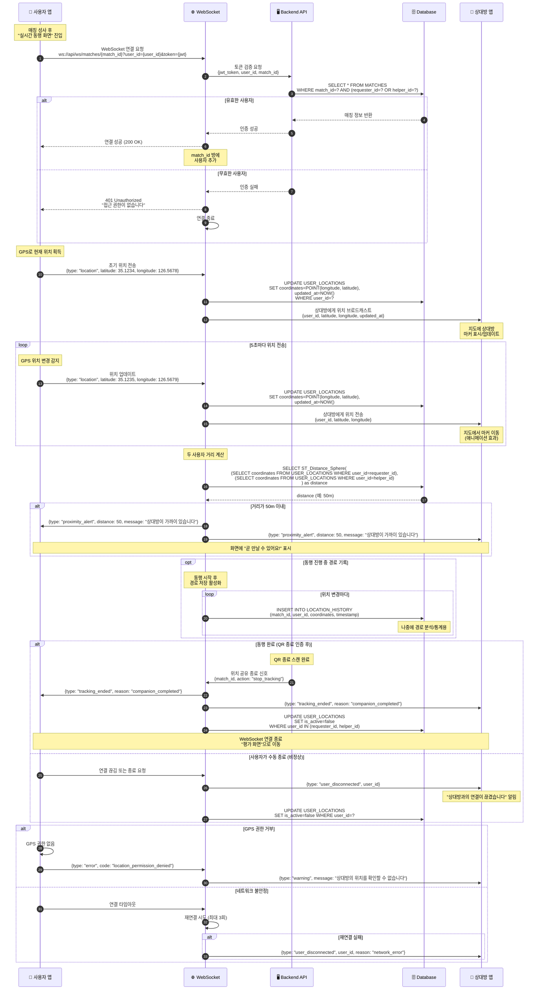
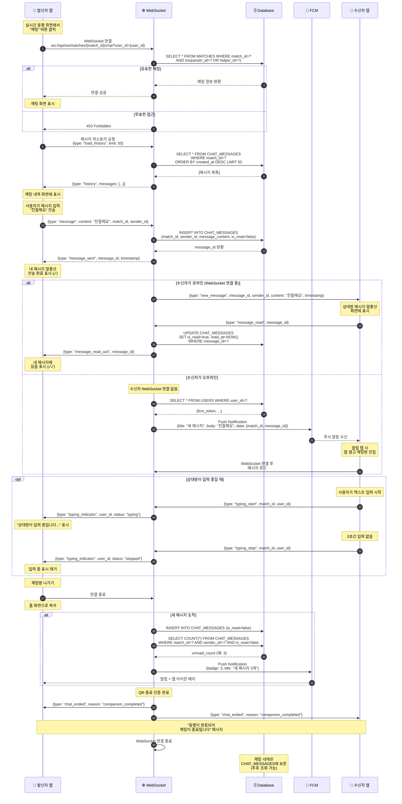

```mermaid
sequenceDiagram
    autonumber
    
    participant RA as 👤 요청자 앱
    participant API as 🖥️ Backend API
    participant DB as 🗄️ Database
    participant FCM as 📱 FCM
    participant HA as 👤 도우미 앱

    %% ============================================
    %% 1. 동행 요청 생성
    %% ============================================
    
    Note over RA: 요청자가 지도에서<br/>"동행 요청하기" 클릭
    
    RA->>API: POST /api/companion-requests<br/>{start_location, destination, estimated_minutes}
    
    API->>DB: INSERT INTO COMPANION_REQUESTS<br/>(requester_id, start_location, destination, ...)
    DB-->>API: request_id 반환
    
    API->>DB: INSERT INTO USER_LOCATIONS<br/>(requester_id, coordinates, is_active=true)
    
    API-->>RA: 201 Created<br/>{request_id, status: "pending"}
    
    Note over RA: "요청이 전송되었습니다"<br/>화면에 표시
    
    %% ============================================
    %% 1-1. 매칭 타임아웃 처리 (백그라운드)
    %% ============================================
    
    Note over API: [백그라운드 작업]<br/>매 1분마다 Cron Job 실행
    
    opt 매칭 타임아웃 체크
        API->>DB: SELECT * FROM COMPANION_REQUESTS<br/>WHERE status='pending' AND expires_at < NOW()
        
        alt 만료된 요청 발견
            DB-->>API: [만료된 요청 목록]
            
            loop 각 만료된 요청마다
                API->>DB: UPDATE COMPANION_REQUESTS<br/>SET status='expired' WHERE request_id=?
                
                API->>DB: INSERT INTO NOTIFICATIONS<br/>(user_id=requester_id, type='request_expired',<br/>title='요청 만료', content='매칭되지 않았습니다')
                
                API->>FCM: Push to 요청자<br/>"요청이 만료되었습니다. 다시 시도해주세요"
            end
        end
    end
    
    %% ============================================
    %% 2. 주변 도우미에게 실시간 알림
    %% ============================================
    
    API->>DB: SELECT user_id FROM USER_LOCATIONS<br/>WHERE ST_Distance_Sphere(coordinates, 요청자위치) <= 5000<br/>AND is_active=true AND user_type IN ('helper', 'both')
    
    DB-->>API: [도우미 ID 목록]
    
    loop 주변 도우미들
        API->>FCM: Push Notification<br/>"주변에 동행 요청이 있습니다"
        FCM-->>HA: 푸시 알림 수신
    end
    
    Note over HA: 도우미가 알림 확인하고<br/>지도에서 요청 클릭
    
    %% ============================================
    %% 3. 도우미가 요청 상세 확인
    %% ============================================
    
    HA->>API: GET /api/companion-requests/{request_id}
    API->>DB: SELECT * FROM COMPANION_REQUESTS<br/>JOIN USERS ON requester_id
    DB-->>API: {요청 정보, 요청자 프로필}
    API-->>HA: 200 OK<br/>{title, destination, requester_profile, ...}
    
    Note over HA: 요청 상세 정보 확인<br/>"수락하기" 버튼 클릭
    
    %% ============================================
    %% 4. 매칭 수락 및 성사
    %% ============================================
    
    HA->>API: POST /api/matches<br/>{request_id, helper_id}
    
    API->>DB: UPDATE COMPANION_REQUESTS<br/>SET status='matching'<br/>WHERE request_id=? AND status='pending'
    
    alt 업데이트 성공 (중복 방지)
        DB-->>API: 1 row affected
        
        API->>DB: INSERT INTO MATCHES<br/>(request_id, requester_id, helper_id, status='accepted')
        DB-->>API: match_id 반환
        
        Note over API: 시작/종료 QR 코드 미리 생성
        
        API->>DB: INSERT INTO QR_AUTHENTICATIONS<br/>(match_id, auth_type='start', qr_code=UUID())
        DB-->>API: start_qr_code 반환
        
        API->>DB: INSERT INTO QR_AUTHENTICATIONS<br/>(match_id, auth_type='end', qr_code=UUID())
        DB-->>API: end_qr_code 반환
        
        API->>DB: INSERT INTO NOTIFICATIONS (요청자에게)<br/>(user_id=requester_id, type='match_accepted')
        
        API-->>HA: 201 Created<br/>{match_id, requester_info, start_qr_code}
        
        API->>FCM: Push to 요청자<br/>"도우미가 수락했습니다!"
        FCM-->>RA: 푸시 알림 수신
        
        Note over RA,HA: 매칭 성사!<br/>양쪽 모두 "실시간 동행 화면"으로 이동
        
    else 이미 매칭됨 (중복 방지)
        DB-->>API: 0 rows affected
        
        API-->>HA: 409 Conflict<br/>"이미 다른 도우미와 매칭되었습니다"
        
        Note over HA: "아쉽지만 다른 도우미가<br/>먼저 수락했습니다" 표시
    end
    
    %% ============================================
    %% 5. 실시간 위치 공유 시작
    %% ============================================
    
    par 요청자와 도우미가 동시에
        RA->>API: WebSocket 연결<br/>/ws/matches/{match_id}
        API-->>RA: 연결 성공
    and
        HA->>API: WebSocket 연결<br/>/ws/matches/{match_id}
        API-->>HA: 연결 성공
    end
    
    Note over RA,HA: 서로의 실시간 위치를<br/>지도에서 확인하며 만남
    
    loop 5초마다 위치 전송
        RA->>API: WebSocket: {latitude, longitude}
        API->>HA: 요청자 위치 업데이트
        HA->>API: WebSocket: {latitude, longitude}
        API->>RA: 도우미 위치 업데이트
    end
    
    %% ============================================
    %% 6. 만남 및 QR 시작 인증
    %% ============================================
    
    Note over RA,HA: 두 사람이 만남!
    
    Note over RA: 요청자가 "QR 코드 보기" 버튼 클릭<br/>시작 QR 코드 화면에 표시
    
    RA->>API: GET /api/matches/{match_id}/qr/start
    API->>DB: SELECT qr_code FROM QR_AUTHENTICATIONS<br/>WHERE match_id=? AND auth_type='start'
    DB-->>API: start_qr_code
    API-->>RA: {qr_code, qr_image_url}
    
    Note over RA: QR 코드를 도우미에게 보여줌
    
    Note over HA: 도우미가 "QR 스캔" 버튼 클릭<br/>카메라로 요청자 QR 스캔
    
    HA->>API: POST /api/qr/scan<br/>{qr_code, scanned_by: helper_id, location}
    
    API->>DB: SELECT * FROM QR_AUTHENTICATIONS<br/>WHERE qr_code=? AND auth_type='start'
    DB-->>API: {auth_id, match_id, auth_type='start'}
    
    alt QR 코드 유효
        API->>DB: UPDATE QR_AUTHENTICATIONS<br/>SET scanned_by_user_id=?, scanned_at=NOW()
        
        API->>DB: UPDATE MATCHES<br/>SET status='ongoing', started_at=NOW()
        
        API->>DB: UPDATE COMPANION_REQUESTS<br/>SET status='ongoing'
        
        API-->>HA: 200 OK<br/>"동행이 시작되었습니다"
        
        API->>FCM: Push to 요청자<br/>"동행이 시작되었습니다"
        FCM-->>RA: 알림 수신
        
        Note over RA,HA: 동행 시작!<br/>"진행 중" 화면으로 전환
        
    else QR 코드 무효/만료
        API-->>HA: 400 Bad Request<br/>"유효하지 않은 QR 코드입니다"
    end
    
    %% ============================================
    %% 7. 동행 진행 중
    %% ============================================
    
    Note over RA,HA: 함께 목적지로 이동 중
    
    par 동행 중 가능한 기능들
        Note over RA,HA: 실시간 채팅
        RA->>API: POST /api/matches/{match_id}/messages<br/>{message: "친절해요"}
        API->>DB: INSERT INTO CHAT_MESSAGES
        API-->>HA: WebSocket으로 메시지 전달
        
    and
        Note over RA,HA: SOS 긴급 버튼
        RA->>API: POST /api/sos<br/>{match_id, location}
        API->>FCM: 관리자 및 긴급연락처에 알림
        
    and
        Note over RA,HA: 위치 추적 계속
        loop 계속 위치 공유
            RA->>API: WebSocket: 위치 업데이트
            HA->>API: WebSocket: 위치 업데이트
        end
    end
    
    %% ============================================
    %% 8. 목적지 도착 및 QR 종료 인증
    %% ============================================
    
    Note over RA,HA: 목적지 도착!
    
    Note over RA: 요청자가 "종료 QR 보기" 클릭<br/>종료 QR 코드 화면에 표시<br/>(매칭 시 이미 생성됨)
    
    RA->>API: GET /api/matches/{match_id}/qr/end
    API->>DB: SELECT qr_code FROM QR_AUTHENTICATIONS<br/>WHERE match_id=? AND auth_type='end'
    DB-->>API: end_qr_code
    API-->>RA: {qr_code, qr_image_url}
    
    Note over RA: QR 코드를 도우미에게 보여줌
    
    Note over HA: 도우미가 종료 QR 스캔
    
    HA->>API: POST /api/qr/scan<br/>{qr_code, scanned_by: helper_id, location}
    
    API->>DB: SELECT * FROM QR_AUTHENTICATIONS<br/>WHERE qr_code=? AND auth_type='end'
    DB-->>API: {auth_id, match_id, auth_type='end'}
    
    alt QR 코드 유효
        API->>DB: UPDATE QR_AUTHENTICATIONS<br/>SET scanned_by_user_id=?, scanned_at=NOW()
        
        API->>DB: UPDATE MATCHES<br/>SET status='completed', completed_at=NOW(),<br/>actual_duration_minutes=TIMESTAMPDIFF(MINUTE, started_at, NOW())
        
        API->>DB: UPDATE COMPANION_REQUESTS<br/>SET status='completed'
        
        %% ============================================
        %% 9. 포인트 및 봉사시간 지급
        %% ============================================
        
        Note over API,DB: 보상 계산 로직
        
        API->>DB: SELECT actual_duration_minutes FROM MATCHES<br/>WHERE match_id=?
        DB-->>API: actual_duration_minutes (예: 25분)
        
        Note over API: 포인트 = 시간 * 10 (예: 250p)<br/>봉사시간 = 실제 소요 시간
        
        API->>DB: UPDATE MATCHES<br/>SET earned_points=250, earned_volunteer_minutes=25
        
        %% 도우미에게 포인트 지급
        API->>DB: UPDATE USERS<br/>SET total_points = total_points + 250,<br/>total_companions = total_companions + 1<br/>WHERE user_id = helper_id
        
        API->>DB: INSERT INTO POINTS_HISTORY<br/>(user_id=helper_id, points_change=+250,<br/>transaction_type='earn', source_type='companion')
        
        %% 도우미에게 봉사시간 기록
        API->>DB: INSERT INTO VOLUNTEER_HOURS<br/>(user_id=helper_id, match_id, minutes=25)
        
        API->>DB: UPDATE USERS<br/>SET total_volunteer_minutes = total_volunteer_minutes + 25<br/>WHERE user_id = helper_id
        
        %% 요청자 동행 횟수 증가
        API->>DB: UPDATE USERS<br/>SET total_companions = total_companions + 1<br/>WHERE user_id = requester_id
        
        API-->>HA: 200 OK<br/>"동행이 완료되었습니다"<br/>{earned_points: 250, earned_minutes: 25}
        
        API->>FCM: Push to 요청자<br/>"동행이 완료되었습니다"
        FCM-->>RA: 알림 수신
        
        Note over RA,HA: 동행 완료!<br/>"평가 화면"으로 이동
        
    else QR 코드 무효
        API-->>HA: 400 Bad Request<br/>"유효하지 않은 QR 코드입니다"
    end
    
    %% ============================================
    %% 10. 상호 평가
    %% ============================================
    
    Note over RA,HA: 서로에게 별점과 후기 남기기
    
    par 도우미가 요청자 평가
        HA->>API: POST /api/reviews<br/>{match_id, reviewer_id: helper_id,<br/>reviewee_id: requester_id, rating: 5,<br/>comment: "감사합니다",<br/>selected_badges: ["친절해요", "시간 잘 지켰어요"]}
        
        API->>DB: INSERT INTO REVIEWS<br/>(match_id, reviewer_id, reviewee_id, rating, comment, selected_badges)
        
        API->>DB: UPDATE USERS<br/>SET companion_score = (평균 별점 계산)<br/>WHERE user_id = requester_id
        
        API-->>HA: 201 Created<br/>"평가가 완료되었습니다"
        
    and 요청자가 도우미 평가
        RA->>API: POST /api/reviews<br/>{match_id, reviewer_id: requester_id,<br/>reviewee_id: helper_id, rating: 5,<br/>comment: "정말 도움이 되었어요",<br/>selected_badges: ["친절해요", "소통이 원활해요"]}
        
        API->>DB: INSERT INTO REVIEWS<br/>(match_id, reviewer_id, reviewee_id, rating, comment, selected_badges)
        
        API->>DB: UPDATE USERS<br/>SET companion_score = (평균 별점 계산)<br/>WHERE user_id = helper_id
        
        API-->>RA: 201 Created<br/>"평가가 완료되었습니다"
    end
    
    %% ============================================
    %% 11. 배지 획득 체크
    %% ============================================
    
    Note over API,DB: 배지 획득 조건 체크
    
    API->>DB: SELECT total_companions FROM USERS<br/>WHERE user_id = helper_id
    DB-->>API: total_companions (예: 10회)
    
    alt 배지 획득 조건 충족
        API->>DB: INSERT INTO BADGES<br/>(user_id=helper_id, badge_type_id=1)<br/>-- 예: "첫걸음 천사" 배지
        
        API->>DB: INSERT INTO NOTIFICATIONS<br/>(user_id=helper_id, type='badge_earned',<br/>title='새로운 배지 획득!', content='첫걸음 천사')
        
        API->>FCM: Push to 도우미<br/>"축하합니다! 첫걸음 천사 배지를 획득했습니다"
        FCM-->>HA: 배지 획득 알림
    end
    
    %% ============================================
    %% 12. 완료
    %% ============================================
    
    Note over RA: "홈 화면"으로 복귀<br/>동행 지수 업데이트 확인
    Note over HA: "홈 화면"으로 복귀<br/>포인트/배지 확인
    
    Note over RA,HA: 전체 플로우 종료 ✅
```

```mermaid
sequenceDiagram
    autonumber
    
    participant UA as 👤 사용자 앱
    participant OAuth as 🔐 소셜 로그인
    participant API as 🖥️ Backend API
    participant PASS as 📱 PASS API
    participant DB as 🗄️ Database

    %% ============================================
    %% 1. 앱 실행 및 로그인 화면
    %% ============================================
    
    Note over UA: 앱 최초 실행<br/>"로그인/회원가입" 화면
    
    UA->>UA: 기존 토큰 확인
    
    alt 유효한 토큰 존재
        UA->>API: GET /api/auth/verify<br/>Authorization: Bearer {token}
        
        API->>DB: SELECT * FROM USERS WHERE user_id=?
        DB-->>API: 사용자 정보
        
        API-->>UA: 200 OK {user_info}
        
        Note over UA: 자동 로그인<br/>"홈 화면"으로 이동
        
    else 토큰 없음 또는 만료
        Note over UA: 로그인 필요
    end
    
    %% ============================================
    %% 2. 소셜 로그인
    %% ============================================
    
    Note over UA: 사용자가<br/>"카카오 로그인" 버튼 클릭
    
    UA->>OAuth: 카카오 로그인 요청<br/>scope: profile, email
    
    OAuth->>OAuth: 카카오 로그인 페이지
    
    Note over OAuth: 사용자 인증
    
    OAuth-->>UA: Authorization Code 반환
    
    UA->>API: POST /api/auth/social-login<br/>{provider: "kakao", code: "abc123"}
    
    API->>OAuth: 카카오 토큰 교환<br/>POST https://kauth.kakao.com/oauth/token
    
    OAuth-->>API: {access_token, id_token, ...}
    
    API->>OAuth: 사용자 정보 조회<br/>GET https://kapi.kakao.com/v2/user/me
    
    OAuth-->>API: {id: "kakao_12345", email: "user@example.com", ...}
    
    %% ============================================
    %% 3. 회원 존재 여부 확인
    %% ============================================
    
    API->>DB: SELECT * FROM USERS<br/>WHERE email='user@example.com'
    
    alt 기존 회원
        DB-->>API: 사용자 정보 반환
        
        API->>API: JWT 토큰 생성<br/>{user_id, email, exp: 30일}
        
        API-->>UA: 200 OK<br/>{token, user_id, is_new_user: false}
        
        Note over UA: 자동 로그인<br/>"홈 화면"으로 이동
        
    else 신규 회원
        API->>DB: INSERT INTO USERS<br/>(email, password_hash=NULL, is_verified=false,<br/>created_at=NOW())
        
        DB-->>API: user_id 반환
        
        API->>API: JWT 토큰 생성 (임시)
        
        API-->>UA: 201 Created<br/>{token, user_id, is_new_user: true}
        
        Note over UA: "프로필 설정" 화면으로 이동
    end
    
    %% ============================================
    %% 4. 본인 인증 (PASS)
    %% ============================================
    
    Note over UA: 온보딩 1단계<br/>"본인 인증" 화면
    
    UA->>API: POST /api/auth/verification/request<br/>{user_id, phone: "010-1234-5678"}
    
    API->>PASS: PASS 본인 인증 요청<br/>POST https://pass-api.example.com/verify
    
    PASS-->>API: {session_id, qr_code_url}
    
    API-->>UA: {session_id, qr_code_url}
    
    Note over UA: QR 코드 또는<br/>PASS 앱 자동 실행
    
    Note over PASS: 사용자가 PASS 앱에서<br/>본인 인증 완료
    
    PASS->>API: Webhook 콜백<br/>{session_id, verified: true, name, birth_date, phone}
    
    API->>DB: UPDATE USERS<br/>SET is_verified=true, name=?, phone=?,<br/>birth_date=?, verification_method='PASS'<br/>WHERE user_id=?
    
    API->>UA: Push 또는 Polling<br/>{verified: true}
    
    Note over UA: "인증 완료!" 메시지<br/>다음 단계로 이동
    
    %% ============================================
    %% 5. 프로필 사진 업로드
    %% ============================================
    
    Note over UA: 온보딩 2단계<br/>"프로필 사진 설정"
    
    Note over UA: 사용자가 카메라로<br/>사진 촬영 또는 갤러리 선택
    
    UA->>API: POST /api/users/{user_id}/profile-image<br/>Content-Type: multipart/form-data<br/>[이미지 파일]
    
    API->>API: 이미지 검증<br/>(크기, 형식, 얼굴 인식)
    
    alt 유효한 이미지
        API->>API: 이미지 리사이징 및<br/>S3/Cloud Storage 업로드
        
        API->>DB: UPDATE USERS<br/>SET profile_image_url='https://cdn.../user123.jpg'<br/>WHERE user_id=?
        
        API-->>UA: 200 OK<br/>{profile_image_url}
        
        Note over UA: 프로필 사진 프리뷰 표시
        
    else 유효하지 않은 이미지
        API-->>UA: 400 Bad Request<br/>"얼굴이 명확하게 보이는 사진을 업로드해주세요"
    end
    
    %% ============================================
    %% 6. 프로필 정보 입력
    %% ============================================
    
    Note over UA: 온보딩 3단계<br/>"프로필 정보 입력"
    
    Note over UA: 닉네임, 자기소개,<br/>생년월일, 성별 입력
    
    UA->>API: PUT /api/users/{user_id}/profile<br/>{name: "동행이는우인이", bio: "반갑습니다",<br/>birth_date: "1990-01-01", gender: "male"}
    
    API->>DB: UPDATE USERS<br/>SET name=?, bio=?, birth_date=?, gender=?<br/>WHERE user_id=?
    
    API-->>UA: 200 OK
    
    %% ============================================
    %% 7. 사용자 유형 선택
    %% ============================================
    
    Note over UA: 온보딩 4단계<br/>"사용자 유형 선택"
    
    Note over UA: "도움이 필요해요"<br/>"도움을 드릴래요" 선택
    
    UA->>API: PUT /api/users/{user_id}/user-type<br/>{user_type: "helper"}
    
    API->>DB: UPDATE USERS<br/>SET user_type='helper'<br/>WHERE user_id=?
    
    API->>DB: UPDATE USERS<br/>SET companion_score=50.0<br/>-- 초기 동행 지수 설정
    
    API-->>UA: 200 OK
    
    %% ============================================
    %% 8. 약관 동의
    %% ============================================
    
    Note over UA: 온보딩 5단계<br/>"약관 동의"
    
    Note over UA: [필수] 서비스 이용약관<br/>[필수] 개인정보 처리방침<br/>[필수] 위치정보 이용약관
    
    UA->>API: POST /api/users/{user_id}/consents<br/>{service_terms: true, privacy_policy: true,<br/>location_terms: true}
    
    API->>DB: INSERT INTO USER_CONSENTS<br/>(user_id, consent_type, agreed_at)
    
    API-->>UA: 200 OK
    
    %% ============================================
    %% 9. 가입 완료 및 초기 배지 지급
    %% ============================================
    
    Note over API: 프로필 완성도 체크
    
    API->>DB: SELECT * FROM USERS WHERE user_id=?
    
    alt 모든 필수 정보 입력 완료
        API->>DB: UPDATE USERS<br/>SET is_active=true
        
        API->>DB: INSERT INTO BADGES<br/>(user_id, badge_type_id=1)<br/>-- "첫걸음" 배지 지급
        
        API->>DB: INSERT INTO POINTS_HISTORY<br/>(user_id, points_change=+1000,<br/>transaction_type='earn', source_type='event',<br/>description='가입 축하 보너스')
        
        API->>DB: UPDATE USERS<br/>SET total_points=1000 WHERE user_id=?
        
        API-->>UA: 200 OK<br/>{welcome_message: "동행에 오신 것을 환영합니다!",<br/>earned_points: 1000, badge: "첫걸음"}
        
        Note over UA: "가입 완료!" 축하 화면<br/>"홈 화면"으로 이동
        
    else 필수 정보 누락
        API-->>UA: 400 Bad Request<br/>"프로필을 완성해주세요"
    end
    
    %% ============================================
    %% 10. 위치 권한 요청 (선택)
    %% ============================================
    
    Note over UA: 홈 화면 진입 시<br/>위치 권한 요청 팝업
    
    UA->>UA: 시스템 위치 권한 요청
    
    alt 권한 허용
        UA->>API: POST /api/users/{user_id}/location<br/>{latitude, longitude}
        
        API->>DB: INSERT INTO USER_LOCATIONS<br/>(user_id, coordinates, is_active=true)
        
        Note over UA: 지도 기반 기능 활성화
        
    else 권한 거부
        Note over UA: "나중에 설정에서<br/>변경할 수 있습니다" 안내
    end
```

# 동행(Dongheng) 시퀀스 다이어그램

> 작성일: 2025-10-30  
> 버전: 1.0  
> 기반: 데이터베이스 스키마 v1.3 + UI/UX 목업

---

## 📋 목차

1. [동행 매칭 전체 플로우 (핵심)](#1-동행-매칭-전체-플로우)
2. [실시간 위치 추적](#2-실시간-위치-추적)
3. [채팅 시스템](#3-채팅-시스템)
4. [회원가입 및 프로필 설정](#4-회원가입-및-프로필-설정)

---

## 1. 동행 매칭 전체 플로우

> **핵심 비즈니스 로직**: 요청 생성 → 매칭 → QR 인증 → 동행 진행 → 평가

### 참여자 (Actors)
- 👤 **요청자 앱** (Requester App)
- 👤 **도우미 앱** (Helper App)
- 🖥️ **백엔드 API** (Backend API)
- 🗄️ **데이터베이스** (Database)
- 📱 **푸시 알림** (FCM)

---

## 주요 API 엔드포인트 (추출)

위 시퀀스에서 사용된 API 목록:

### 동행 요청 관련
- `POST /api/companion-requests` - 동행 요청 생성
- `GET /api/companion-requests/{id}` - 요청 상세 조회

### 매칭 관련
- `POST /api/matches` - 매칭 수락
- `GET /api/matches/{id}` - 매칭 정보 조회

### QR 인증 관련
- `GET /api/matches/{id}/qr/start` - 시작 QR 코드 조회
- `GET /api/matches/{id}/qr/end` - 종료 QR 코드 조회
- `POST /api/qr/scan` - QR 코드 스캔 인증

### 실시간 통신
- `WebSocket /ws/matches/{id}` - 위치 공유 및 채팅

### 평가
- `POST /api/reviews` - 후기 작성

### 긴급
- `POST /api/sos` - SOS 긴급 신고

---

## 비즈니스 로직 요약

### 1. 매칭 프로세스
- 요청자가 요청 생성 → 주변 5km 이내 도우미들에게 푸시 알림
- 도우미 중 1명이 수락 → 매칭 성사
- 다른 도우미들에게는 "이미 매칭되었습니다" 표시

### 2. QR 인증
- **시작/종료 모두 도우미가 스캔** (요청자는 QR만 보여줌)
- QR 코드는 UUID 기반 랜덤 생성
- 스캔 시 위치 정보도 함께 기록 (부정 방지)

### 3. 보상 계산
- **포인트**: `실제 소요 시간(분) × 10` (예: 25분 → 250p)
- **봉사시간**: `실제 소요 시간` (분 단위)
- 도우미에게만 지급

### 4. 동행 지수 계산
- 받은 별점의 평균값
- 매 평가 후 재계산하여 `USERS.companion_score` 업데이트

---

---

## 2. 실시간 위치 추적

> **목적**: 매칭 후 요청자와 도우미가 서로의 위치를 실시간으로 확인하며 만날 수 있도록 지원

### 참여자
- 👤 **사용자 앱** (User App)
- 🖥️ **백엔드 API** (Backend API)
- 🗄️ **데이터베이스** (Database)
- 🌐 **WebSocket 서버** (WebSocket Server)

---

## 3. 채팅 시스템

> **목적**: 매칭된 요청자와 도우미 간 실시간 1:1 채팅

### 참여자
- 👤 **발신자 앱** (Sender App)
- 🌐 **WebSocket 서버** (WebSocket)
- 🗄️ **데이터베이스** (Database)
- 👤 **수신자 앱** (Receiver App)
- 📱 **푸시 알림** (FCM)

---

## 4. 회원가입 및 프로필 설정

> **목적**: 신규 사용자의 가입부터 프로필 완성까지의 온보딩 프로세스

### 참여자
- 👤 **사용자 앱** (User App)
- 🖥️ **백엔드 API** (Backend API)
- 🔐 **소셜 로그인** (OAuth Provider)
- 📱 **본인 인증** (PASS/신분증 API)
- 🗄️ **데이터베이스** (Database)

---

## API 엔드포인트 전체 요약

### 인증 관련
- `POST /api/auth/social-login` - 소셜 로그인
- `GET /api/auth/verify` - 토큰 검증
- `POST /api/auth/verification/request` - PASS 본인 인증 요청

### 사용자 프로필
- `PUT /api/users/{id}/profile` - 프로필 정보 수정
- `POST /api/users/{id}/profile-image` - 프로필 사진 업로드
- `PUT /api/users/{id}/user-type` - 사용자 유형 설정
- `POST /api/users/{id}/consents` - 약관 동의

### 위치
- `POST /api/users/{id}/location` - 위치 정보 전송
- `WebSocket /ws/matches/{id}` - 실시간 위치 공유

### 채팅
- `WebSocket /ws/matches/{id}/chat` - 실시간 채팅

---

## 다음 단계

✅ **완료된 시퀀스 다이어그램:**
1. ✅ 동행 매칭 전체 플로우
2. ✅ 실시간 위치 추적
3. ✅ 채팅 시스템
4. ✅ 회원가입 및 프로필 설정

**다음 작업 제안:**
- [ ] API 명세서 작성 (RESTful + WebSocket)
- [ ] SQL 스크립트 생성 (CREATE TABLE)
- [ ] 에러 코드 정의
- [ ] 보안 정책 문서

---

**작성자**: Claude (Anthropic AI)  
**버전**: 1.0 (전체 완성)  
**최종 수정일**: 2025-10-30
